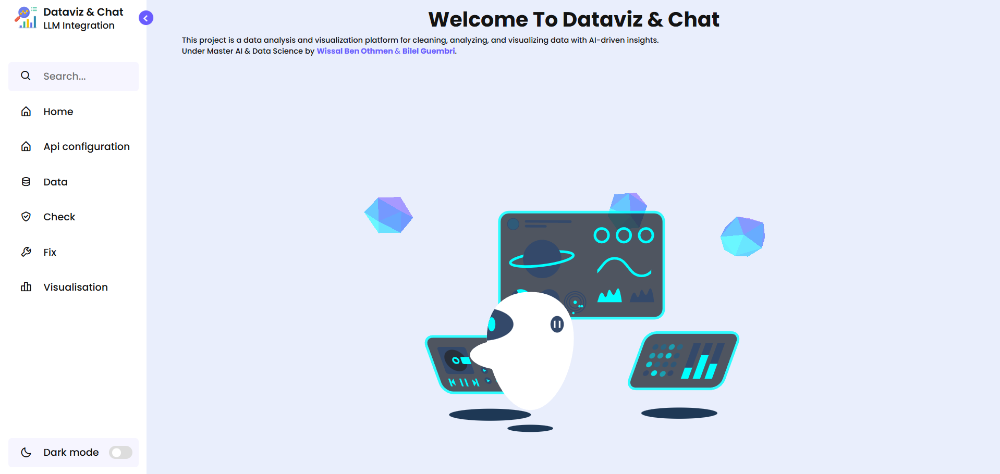
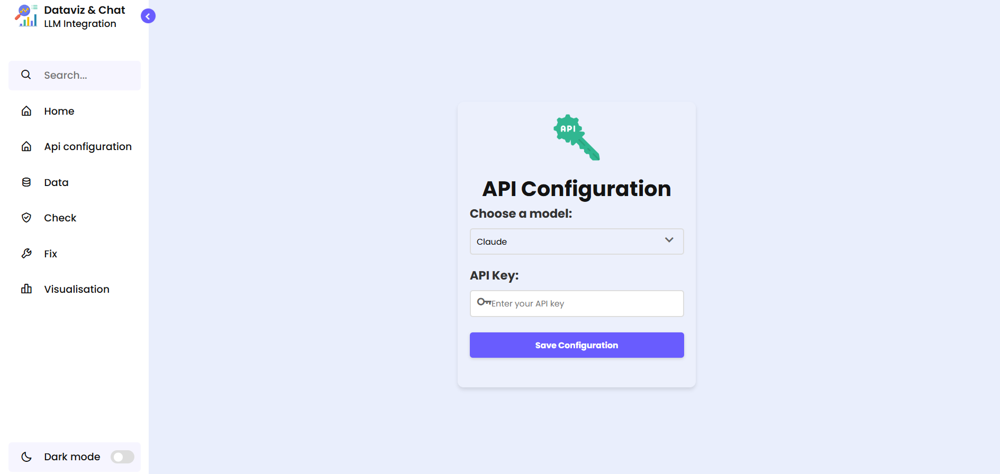
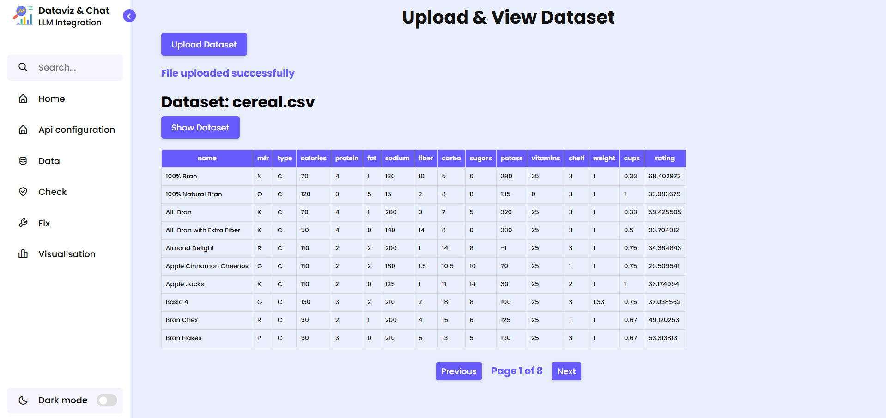
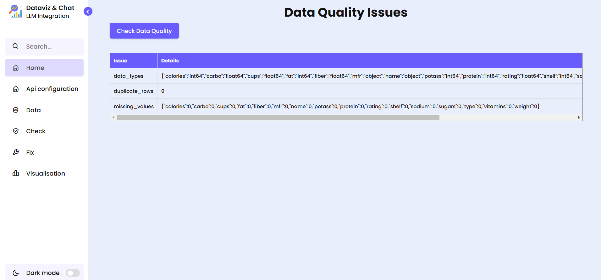
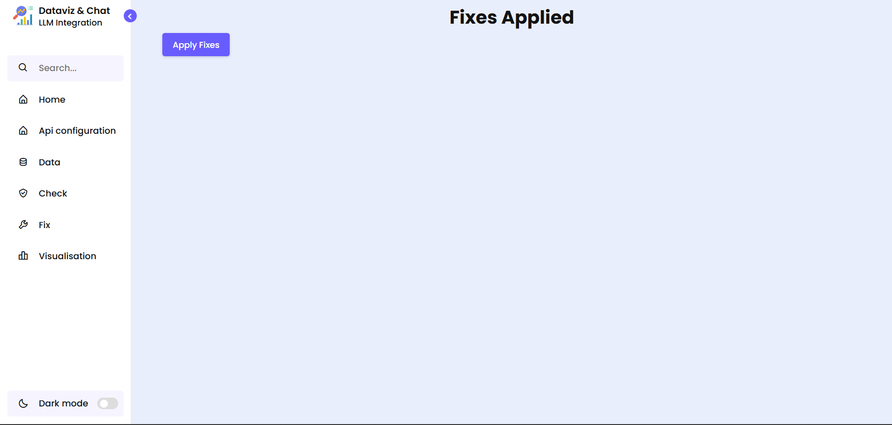
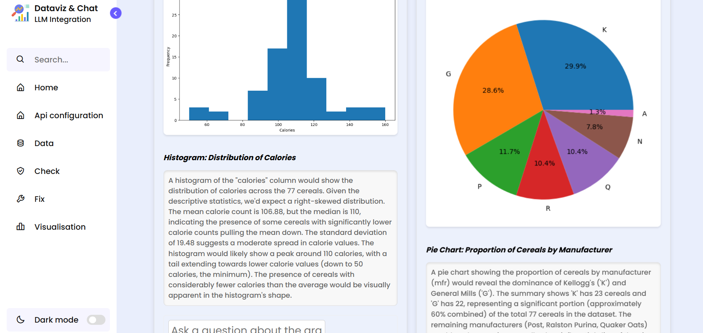
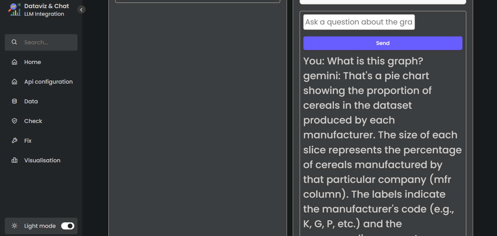
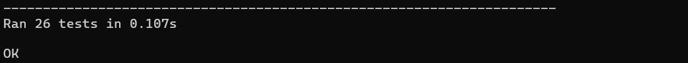

# Data Visualization App with AI-Powered Insights

This project is a Flask-based web application designed to simplify data analysis and visualization. It allows users to upload data in various formats, perform data quality checks, clean the data, and generate interactive visualizations. The application leverages AI (Gemini and Claude) to provide intelligent suggestions for visualizations and interpretations of generated graphs. Additionally, it features an interactive chat interface where users can ask questions about their data and visualizations.

This project was developed as part of the Master AI & Data Science program by Wissal Ben Othmen & Bilel Guembri.

## Project Demo

A live demo of the application is available here: [Data Visualization App](https://data-visualisation-ask-llm.onrender.com/welcome)

## Documentation

Comprehensive documentation, including detailed explanations of all functions, is available here: [Project Documentation](https://guembri01.github.io/Data-visualisation-ask-LLM/)

## Installation

### 1. Clone the Repository

```bash
git clone https://github.com/Guembri01/Data-visualisation-ask-LLM
cd Data-visualisation-ask-LLM
```

### 2. Create and Activate a Virtual Environment (Recommended)

#### Using `venv` (Recommended)
```bash
python3 -m venv env
source env/bin/activate  # On Linux/macOS
env\Scripts\activate  # On Windows
```

#### Using `virtualenv` (If Installed)
```bash
virtualenv env
source env/bin/activate  # On Linux/macOS
env\Scripts\activate  # On Windows
```

### 3. Install Dependencies

```bash
pip install -r requirements.txt
```

### 4. Run the Application
```bash
python app.py
```
The app will run at `http://127.0.0.1:5000/` by default.

## Project Structure

- `app.py` - Main Flask application file containing routes and logic.
- `utils.py` - Utility functions for data processing, AI model interaction, and plot generation.
- `templates/` - HTML templates for the web interface.
- `static/` - Static files (CSS, JavaScript, images).
- `uploads/` - Directory to store uploaded files (created automatically).
- `requirements.txt` - List of project dependencies.
- `tests/` - Directory containing unit tests to ensure code reliability.
- `docs/` - Files for generating project documentation using Sphinx.
- `images/` - Screenshots of the application.

## Features

- **Data Upload:** Supports multiple formats (CSV, Excel, JSON, TSV, Parquet, Feather, ORC, XML, HTML, HDF5).
- **Data Quality Checks:** Detects missing values, duplicate rows, and data type inconsistencies.
- **Data Cleaning:** Tools for handling missing data and removing duplicate rows.
- **Interactive Visualizations:** AI-assisted generation of various plots using Matplotlib and Seaborn.
- **AI-Powered Insights:**
  - **Plot Suggestions:** Recommends suitable visualizations based on the dataset.
  - **Graph Interpretation:** Provides textual insights into generated plots.
  - **Interactive Chat:** Allows users to inquire about graphs and data using natural language.
- **Model Selection:** Supports Google's Gemini 1.5 Flash and Anthropic's Claude 3 Opus for AI features.
- **API Key Configuration:** Requires API keys for the chosen AI model.

## Screenshots

1. **Home Page**
   
2. **Data Information**
   
3. **Data Check**
   
4. **Data Fix**
   
5. **Visualization Page (Selecting Model)**
   
6. **Visualization Page (Gemini Results)**
   
7. **Visualization Page (Claude Results)**
   
8. **Interactive Graph Chat**
   

## Testing

The project includes a suite of unit tests to ensure the reliability of core components. Tests are located in the `tests/` directory.

Run the tests using `unittest`:

```bash
python -m unittest discover -s tests -p "test_app.py"
```

This command:

- Uses `unittest` to execute tests.
- Automatically discovers test files in the `tests/` directory.
- Runs all test files matching the pattern `test_*.py`.

A successful test run indicates that the core functionalities work as expected.



## Contributing

Contributions are welcome! Please refer to the `CONTRIBUTING.md` file (to be created) for guidelines. Before contributing, consider opening an issue to discuss proposed changes.

## License

This project will be licensed under the MIT License (to be created). Please add a `LICENSE` file containing the MIT license text.

